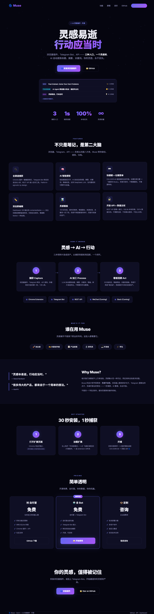
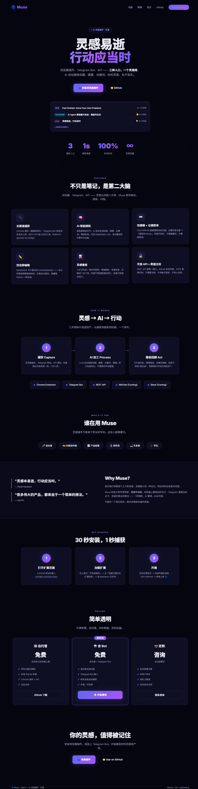
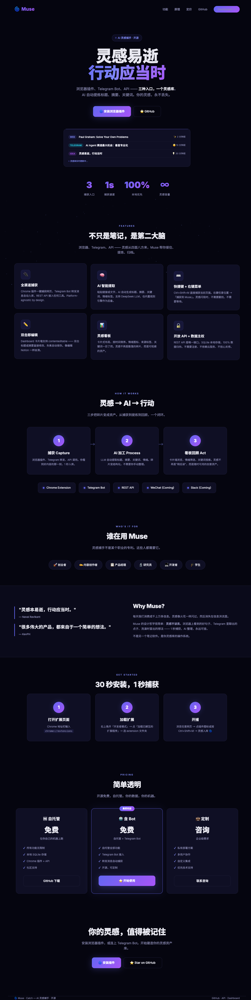
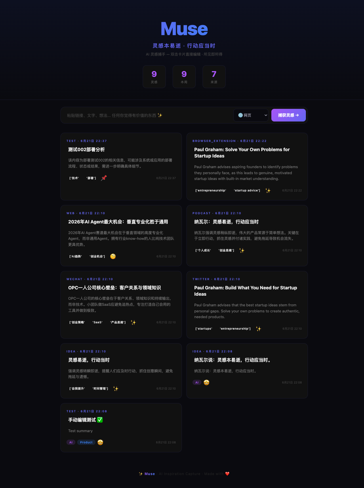

# 🌀 Muse · Catch — AI Inspiration Capture

> **"Inspiration is perishable. Act on it immediately." — Naval Ravikant**
>
> Muse catches every spark — from browsing, chatting, or thinking — and turns it into structured, searchable inspiration you'll never lose.

[](LICENSE)
[](https://python.org)
[](#-browser-extension)

---

## ✨ What is Muse?

You read an article. A tweet. A podcast. A brilliant idea flashes — then disappears forever.

Muse is your **AI-powered inspiration operating system**:

- 🖥️ **Chrome Extension** — one-click capture while browsing (`Ctrl+Shift+M`)
- 🤖 **Telegram Bot** — forward any message to your inspiration library
- 🧠 **AI Extraction** — auto-generates title, summary, keywords, emotion tags
- 📊 **Web Dashboard** — card wall, search, edit, never lose an idea again
- 🏠 **Local-First** — SQLite on your machine. Your data, your rules.

### 📸 Landing Page







### 📸 Dashboard



---

## ⚡ 30-Second Quick Start

```bash
# 1. Clone
git clone https://github.com/KevPH/muse-catch.git
cd muse-catch

# 2. Start API
python3 server.py
# → Muse API running on http://localhost:5200

# 3. Open Dashboard
open http://localhost:5200
```

**First capture:**
```bash
curl -X POST http://localhost:5200/api/ingest \
  -H 'Content-Type: application/json' \
  -d '{"source":"web","content":"My first inspiration","tags":["test"]}'
```

🎉 Done! You just captured your first inspiration. Open the Dashboard to see it.

---

## 🏗️ Architecture

```
┌──────────────────────────────────────────────────┐
│                    YOU                            │
│  Chrome Extension · Telegram · API · Dashboard   │
└────────┬──────────┬──────────┬──────────────────┘
         │          │          │
         ▼          ▼          ▼
    POST /api/ingest (Flask :5200)
         │
         ├─ llm_extract() ── DeepSeek LLM / Rule-based
         │
         ▼
      SQLite (muse.db)
         │
         ▼
   Web Dashboard (index.html)
```

---

## 📦 What's Inside

| Component | Description | Tech |
|---|---|---|
| `server.py` | REST API + DB | Flask, SQLite |
| `index.html` | Web Dashboard | Vanilla JS, Single File |
| `landing.html` | Product Landing Page | HTML/CSS |
| `extension/` | Chrome Extension (MV3) | JS, Manifest V3 |
| `bot.py` | Telegram Bot | Python, long-polling |
| `skill/SKILL.md` | AI Agent Skill | Hermes/OpenClaw compatible |
| `BP-BRD.md` | Business Plan + PRD (Chinese) | 500+ lines |

---

## 🖥️ Chrome Extension

```
Chrome → chrome://extensions → Developer Mode → Load Unpacked
→ Select muse-catch/extension/
```

**Three capture modes:**
- 🔌 **Popup** — click icon, auto-fills page title/URL/selection
- ⌨️ **Shortcut** — `Ctrl+Shift+M` captures instantly
- 🖱️ **Context Menu** — right-click → "Capture to Muse"

---

## 🤖 Telegram Bot

```bash
# 1. Create bot with @BotFather → get TOKEN
# 2. Run
export MUSE_BOT_KEY="your-token-here"
python3 bot.py
```

Forward anything to your bot — links, articles, thoughts. Auto-captured. 🌀

---

## 🧠 AI Agent Skill

Muse comes with a **self-onboarding AI Agent skill**. Any AI agent that loads `skill/SKILL.md` will:

1. **Auto-detect** if Muse is running
2. **Guide setup** with one-command instructions
3. **Trigger the "aha moment"** — instant first capture
4. **Walk through** browser extension + Telegram bot installation

> *"I'm your Muse. Let's capture your first inspiration RIGHT NOW."*

[Install as OpenClaw Skill →](https://github.com/KevPH/muse-catch/tree/main/skill)

---

## 🎯 AI Topic Pipeline (New!)

**Inspiration → Topic → Viral Content — 3-stage pipeline**

```
灵感碎片 → AI选题生成 → 点击选题 → Deep Dive 深挖
                          ├── 💥 3 爆款角度
                          ├── 🔥 5 爆款标题
                          ├── 📋 7 段文章结构
                          └── ✨ 5 条金句
```

**Live Demo:**
```bash
bash demo_pipeline.sh
# Seeds 10 inspirations → generates topics → deep-dives first topic
```

| Mode | API | Description |
|------|-----|-------------|
| 🎲 Random | `GET /api/topics?mode=random` | AI picks inspirations, generates topics |
| 🎯 Selected | `GET /api/topics?mode=selected&ids=1,3,5` | Generate from hand-picked inspirations |
| 💥 Deep Dive | `GET /api/topic-deep-dive?topic=垂直AI创业` | Headlines + angles + structure + quotes |

---

## 🔌 Full API

```bash
# Ingest
POST /api/ingest  { "source": "web", "content": "..." }

# List
GET /api/inspirations

# Edit
PATCH /api/ingest/<id>  { "title": "New Title" }

# Stats
GET /api/stats

# Topic Generation (LLM)
GET /api/topics?mode=random
GET /api/topics?mode=selected&ids=1,2,3

# Deep Dive
GET /api/topic-deep-dive?topic=垂直AI创业
```

[Full API Docs →](docs/API.md)

---

## 🌍 Landing Page

**Live:** [muse-catch.vercel.app](https://muse-catch.vercel.app)

Built into the repo as `landing.html` — deploy anywhere. Static, zero dependencies.

---

## 🛠️ For Developers

```bash
# Run with LLM-powered extraction
export DEEPSEEK_API_KEY="sk-xxx"
python3 server.py

# Expose to public internet
lt --port 5200
# → https://xxx.loca.lt

# Deploy landing page
vercel --prod
```

---

## 📄 License

MIT — use it, fork it, build on it.

---

## 🇨🇳 中文

Muse · Catch 是一款 **AI 灵感捕手**：

- 🖥️ **Chrome 插件** — 浏览网页时一键捕获（Ctrl+Shift+M）
- 🤖 **Telegram Bot** — 转发任意消息自动入库
- 🧠 **AI 提取** — 自动生成标题、摘要、关键词、情绪标签
- 📊 **Web 仪表盘** — 卡片墙浏览、双击编辑、灵感永不丢失
- 🏠 **数据主权** — SQLite 本地存储，100% 归你

> **「灵感本易逝，行动应当时。」**
>
> 30 秒安装，1 秒捕获。你的灵感值得被记住。

[30 秒快速开始 →](#-30-second-quick-start)

---

<p align="center">
  <b>🌀 Built for creators who refuse to let inspiration slip away.</b>
</p>
