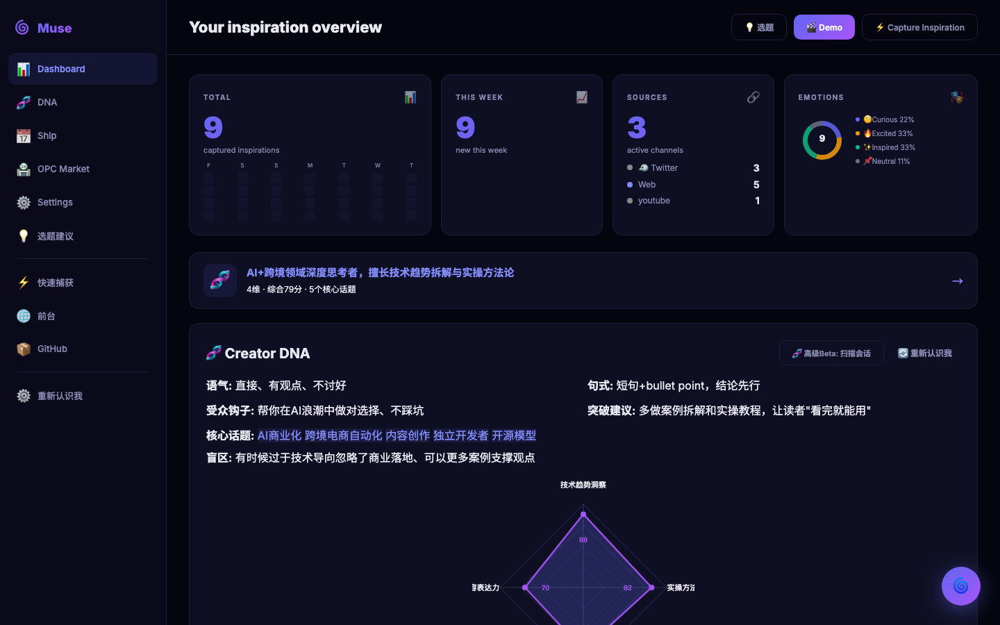
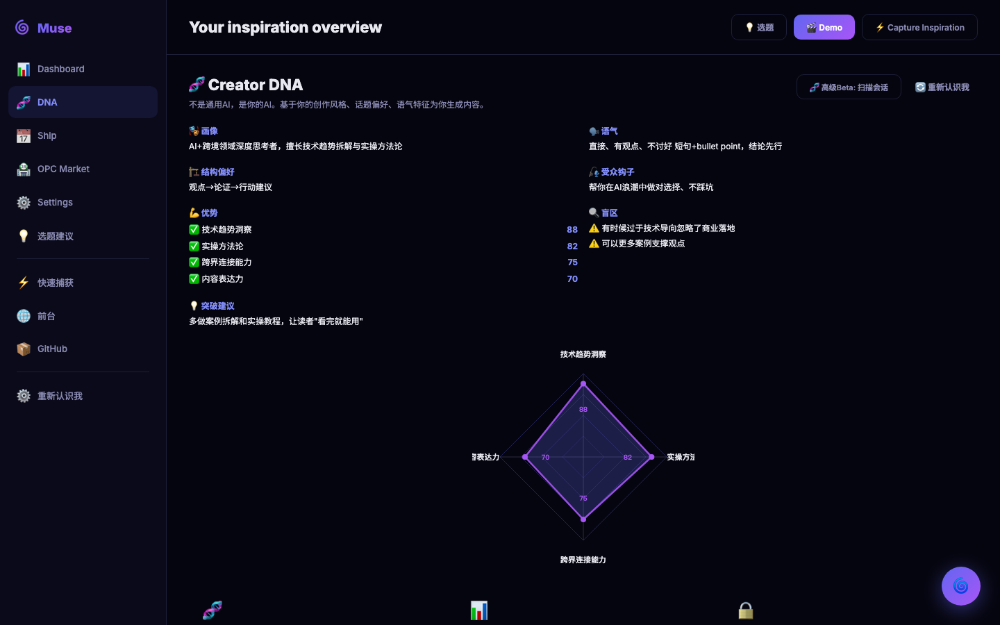
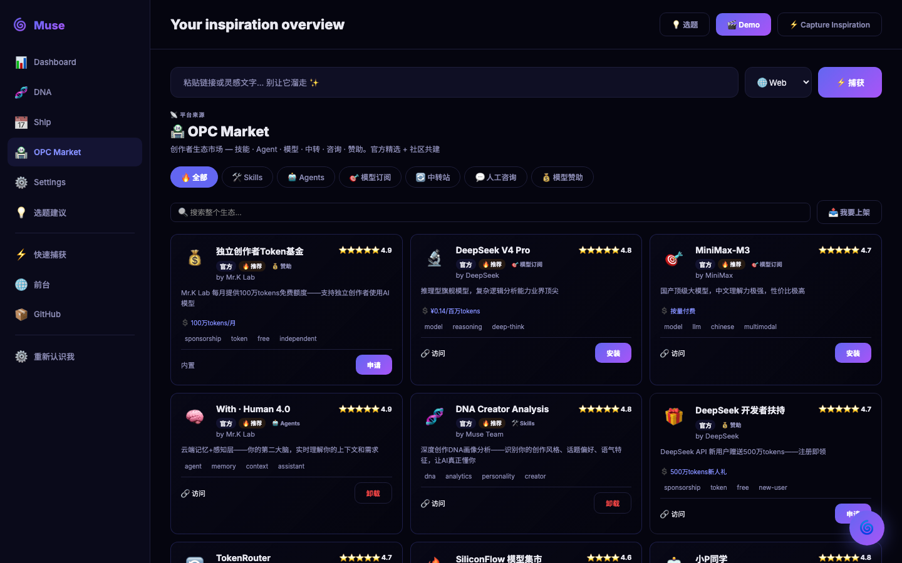
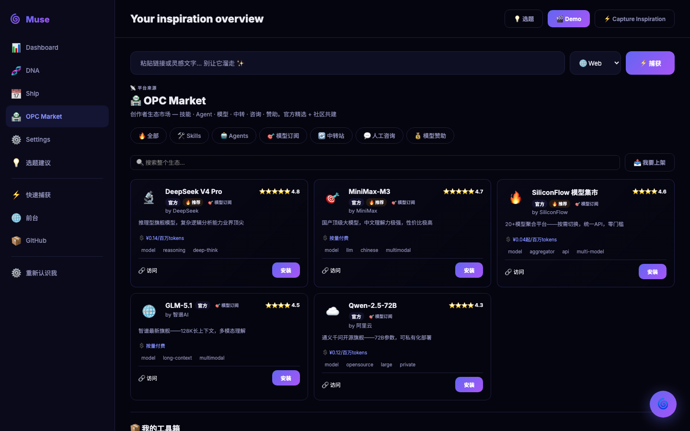
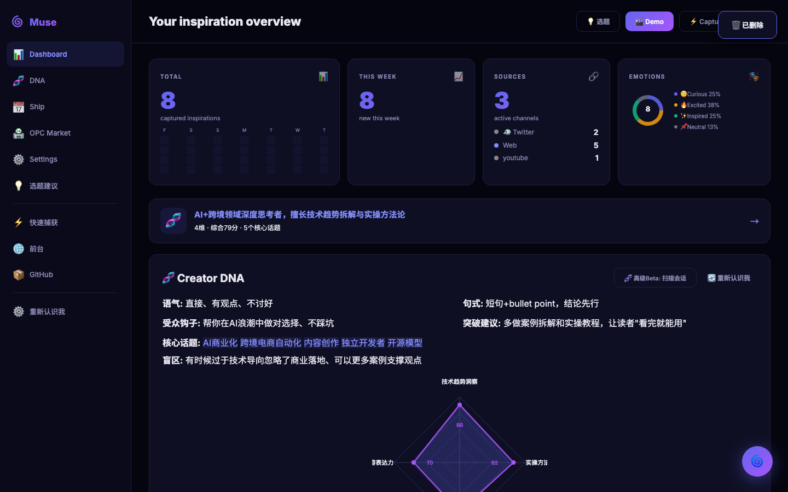
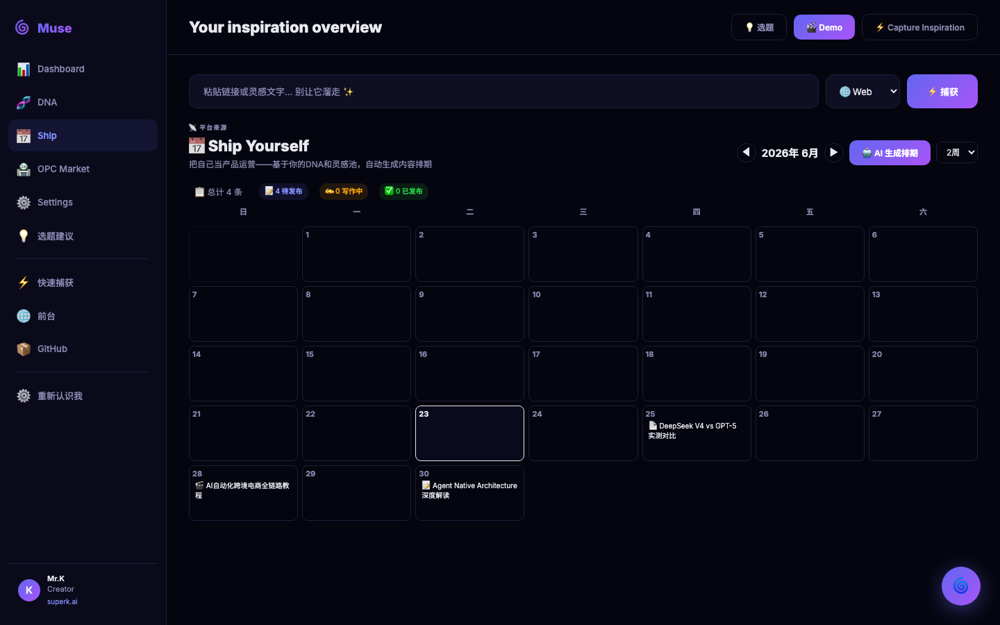
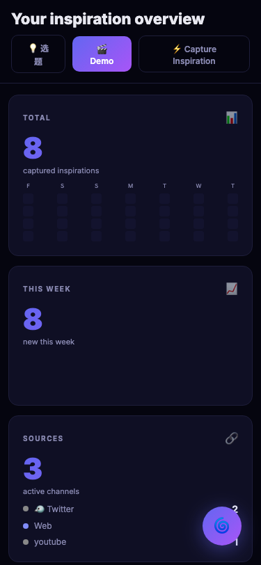
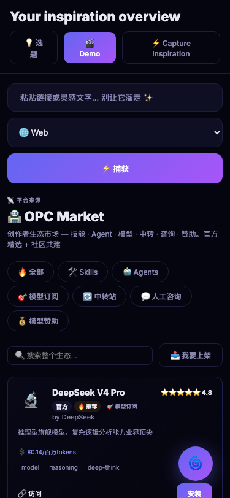

# 🌀 Muse · Catch — AI Inspiration Capture

> **"Inspiration is perishable. Act on it immediately." — Naval Ravikant**
>
> Muse catches every spark — from browsing, chatting, or thinking — and turns it into structured, searchable inspiration you'll never lose.

[](LICENSE)
[](https://python.org)

---

## ✨ What is Muse?

You read an article. A tweet. A podcast. A brilliant idea flashes — then disappears forever.

Muse is your **AI-powered inspiration operating system**:

- 🖥️ **Chrome Extension** — one-click capture while browsing (`Ctrl+Shift+M`)
- 🤖 **Telegram Bot** — forward any message to your inspiration library
- 🧠 **AI Extraction** — auto-generates title, summary, keywords, emotion tags
- 📊 **Web Dashboard** — card wall, search, edit, delete, never lose an idea
- 🧬 **Creator DNA** — radar visualization of your strengths, topics, and blind spots
- 🏪 **OPC Market** — discover & install AI skills, agents, models, and services
- 🏠 **Local-First** — SQLite on your machine. Your data, your rules.

---

## 📸 Screenshots

### Dashboard — Inspiration Card Wall + DNA Radar



### 🧬 Creator DNA — Radar Chart



### 🏪 OPC Market — Skills · Agents · Models · Consulting



### 🏪 Market by Category — Model Subscriptions



### 🗑 Delete Inspirations



### 📅 Ship Yourself — Content Calendar



### 📱 Mobile Dashboard



### 📱 Mobile OPC Market



### Landing Page


---

## ⚡ 30-Second Quick Start

```bash
# 1. Clone
git clone https://github.com/KevPH2026/muse-catch.git
cd muse-catch

# 2. Start API
python3 server.py
# → Muse API running on http://localhost:5200

# 3. Open Dashboard
open http://localhost:5200/app
```

**First capture:**
```bash
curl -X POST http://localhost:5200/api/ingest \
  -H 'Content-Type: application/json' \
  -d '{"source":"web","content":"My first inspiration","tags":["test"]}'
```

🎉 Done! You just captured your first inspiration. Open the Dashboard to see it.

---

## 🏪 OPC Market — AI Ecosystem

Browse, install, and manage AI skills, agents, model subscriptions, relay services, consulting, and token sponsorships — all in one marketplace.

| Category | Examples | Products |
|----------|----------|----------|
| 🛠️ **Skills** | Inspiration Capture, DNA Creator, Social Scheduler | 8 |
| 🤖 **Agents** | With · Human 4.0, 小P同学 | 4 |
| ⚡ **Models** | DeepSeek V4 Pro, MiniMax-M3, GLM-5.1 | 5 |
| 🔄 **Relay** | TokenRouter, API Gateway | 4 |
| 👤 **Consulting** | Mr.K 1v1, Agent Strategy Audit | 4 |
| 💰 **Sponsorship** | Token Fund, Compute Grants | 4 |

**Features:**
- ⭐ Ratings & reviews
- 🏷️ Official / Featured / Community badges
- 💸 Pricing display
- 📦 One-click install/uninstall
- 🔍 Search & category filter

**Live Demo:** [muse.opclab.org/app](https://muse.opclab.org/app) — pre-seeded with 29 products.

---

## 🧬 Creator DNA — Know Yourself

Muse automatically builds your **Creator DNA profile** from your inspirations:

- **6-Dimension Radar Chart** — Insight, Expression, Action, Connection, Creativity, Tech
- **Topic Radar** — What you write about most
- **Tone & Style Analysis** — Your unique voice
- **Blind Spots** — Where you could grow
- **Growth Tips** — Actionable next steps

Shown on both the **Dashboard homepage** and a dedicated **DNA page** with full details.

---

## 🗑 Delete & Manage

- Every card has a 🗑 delete button (red on hover)
- Confirmation dialog before deletion
- Auto-updates stats after delete
- Works in both **local backend** and **demo mode**

---

## 🏗️ Architecture

```
┌──────────────────────────────────────────────────┐
│                    YOU                            │
│  Chrome Extension · Telegram · API · Dashboard   │
└────────┬──────────┬──────────┬──────────────────┘
         │          │          │
         ▼          ▼          ▼
    POST /api/ingest (Flask :5200)
         │
         ├─ llm_extract() ── DeepSeek LLM / Rule-based
         │
         ▼
      SQLite (muse.db)
         │
         ▼
   Web Dashboard (app.html)
```

---

## 📦 What's Inside

| Component | Description | Tech |
|---|---|---|
| `server.py` | REST API + DB + seeding | Flask, SQLite |
| `app.html` | Web Dashboard (210KB) | Vanilla JS, Single File |
| `index.html` | Landing Page | HTML/CSS |
| `extension/` | Chrome Extension (MV3) | JS, Manifest V3 |
| `bot.py` | Telegram Bot | Python, long-polling |
| `skill/SKILL.md` | AI Agent Skill | OpenClaw compatible |

---

## 🖥️ Chrome Extension

```
Chrome → chrome://extensions → Developer Mode → Load Unpacked
→ Select muse-catch/extension/
```

**Three capture modes:**
- 🔌 **Popup** — click icon, auto-fills page title/URL/selection
- ⌨️ **Shortcut** — `Ctrl+Shift+M` captures instantly
- 🖱️ **Context Menu** — right-click → "Capture to Muse"

---

## 🔌 Full API

```bash
# Ingest
POST /api/ingest  { "source": "web", "content": "..." }

# List
GET /api/inspirations

# Edit
PATCH /api/ingest/<id>  { "title": "New Title" }

# Delete
DELETE /api/inspirations/<id>

# Stats
GET /api/stats

# Creator DNA
GET /api/profile
POST /api/dna/scan

# OPC Market
GET /api/skills
POST /api/skills/install/<id>
DELETE /api/skills/install/<id>
GET /api/skills/installed

# Calendar
GET /api/calendar
GET /api/calendar/generate
```

---

## 🌍 Live Demo

**Dashboard:** [muse.opclab.org/app](https://muse.opclab.org/app)  
**Landing:** [muse.opclab.org](https://muse.opclab.org)

The demo comes pre-seeded with 10 inspirations, a full DNA profile, OPC Market products, and a content calendar — so visitors can experience the full product immediately.

---

## 🛠️ For Developers

```bash
# Run with LLM-powered extraction
export DEEPSEEK_API_KEY="sk-xxx"
python3 server.py

# Expose to public internet
lt --port 5200
# → https://xxx.loca.lt

# Deploy
vercel --prod
```

---

## 👤 Author

Built by [**Mr.K**](https://superk.ai) — AI + Cross-Border Commerce strategist, 15 years industry experience.

---

## 📄 License

MIT — use it, fork it, build on it.

---

## 🇨🇳 中文

Muse · Catch 是一款 **AI 灵感捕手**：

- 🖥️ **Chrome 插件** — 浏览网页时一键捕获（Ctrl+Shift+M）
- 🤖 **Telegram Bot** — 转发任意消息自动入库
- 🧠 **AI 提取** — 自动生成标题、摘要、关键词、情绪标签
- 📊 **Web 仪表盘** — 卡片墙浏览、搜索、编辑、删除，灵感永不丢失
- 🧬 **创作者 DNA** — 6 维雷达图展示你的优势、话题、盲区
- 🏪 **OPC 市场** — 发现和安装 AI 技能、Agent、模型、咨询服务
- 🏠 **数据主权** — SQLite 本地存储，100% 归你

> **「灵感本易逝，行动应当时。」**
>
> 30 秒安装，1 秒捕获。你的灵感值得被记住。

[30 秒快速开始 →](#-30-second-quick-start)

---

<p align="center">
  <b>🌀 Built for creators who refuse to let inspiration slip away.</b>
</p>
